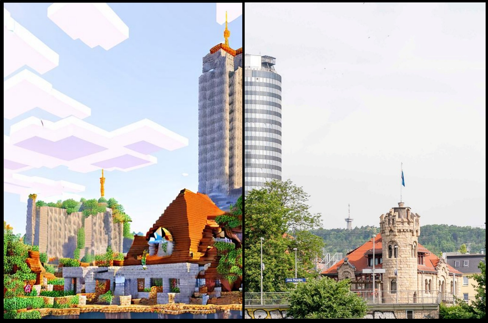

# JenaCraft - Images and Markdown Vorlagen

Im Rahmen der Tätigkeit als wissenschaftliche Hilfskraft in dem DHLabor der Professur Digital-Humanites wurden "Jena-Craft"-Workshops abgehalten. Für das volle Erlebnis der Ergebnispräsentation checken Sie die Webseite [4dcity](href="https://4dcity.org/intro") aus.

## Stationen

### Winterferien Kurs 2025 JZ Polaris
- [Stadtkirche](stationen/Stadtkirche.md)
- [Markt](stationen/Markt.md)
- [Johannestor](stationen/Johannestor.md)

### 34. Witelo Machbar Tag
- [Jentower / Eichplatz](stationen/JenTower_Eichplatz.md)
- [Bau 36](stationen/ZeissGebaude.md)
- [Jugendzentrum Polaris](stationen/Polaris.md)

### Herbstferien Kurs Ernst-Abbe-Bibliothek
- [ERnst-Abbe-Platz](stationen/EAB.md)
- [Goethe-Gallerie](stationen/GoetheGalerie.md)
- [Eichplatz + JenTower](stationen/JenTower_Eichplatz.md)
